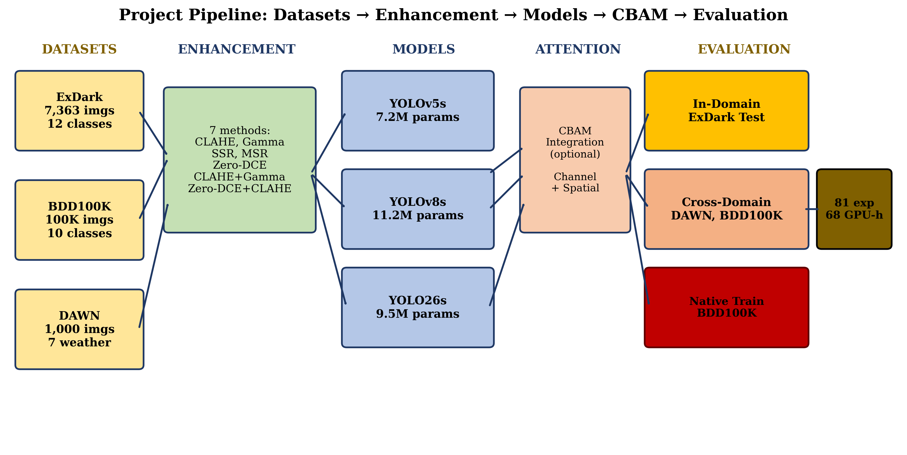
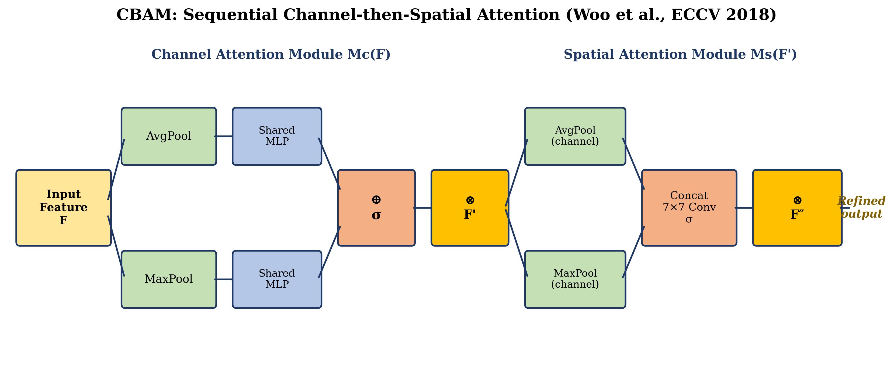
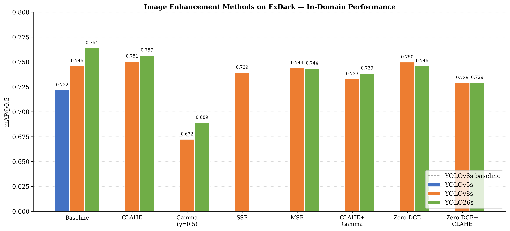
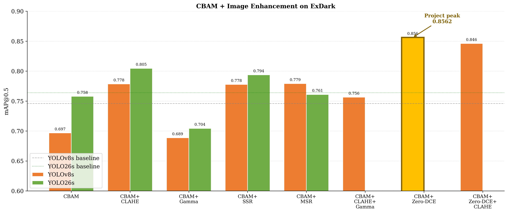
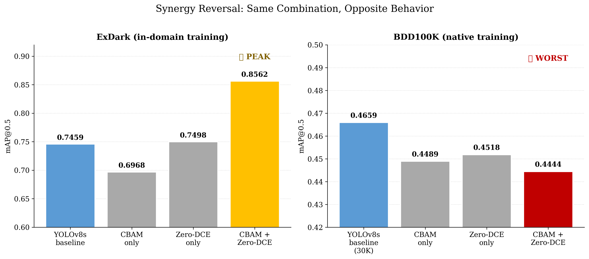

# Low-Light Object Detection for Autonomous Driving

### A Comparative Study of YOLOv5, YOLOv8, and YOLO26 with Image Enhancement Techniques

Graduation project (FENS402, Kadir Has University) studying object detection
in low-light conditions. Combines YOLO detectors (YOLOv5, YOLOv8, YOLO26) with
the CBAM attention module and image enhancement methods (CLAHE, gamma
correction, Retinex, Zero-DCE), evaluated on the ExDark, BDD100K, and DAWN
datasets.



## Pipeline

1. **Environment setup** ([`src/colab_setup.py`](src/colab_setup.py)) — installs
   Ultralytics, mounts Google Drive, creates project folders.
2. **Dataset preparation** ([`src/data_prep/exdark_to_yolo.py`](src/data_prep/exdark_to_yolo.py),
   [`src/data_prep/count_exdark_classes.py`](src/data_prep/count_exdark_classes.py)) —
   converts the ExDark dataset into YOLO format with train/val/test splits.
3. **Image enhancement** ([`src/enhancement/`](src/enhancement)) — classical
   methods (CLAHE, gamma, single/multi-scale Retinex) and Zero-DCE, a deep
   curve-estimation model ([Li et al., CVPR 2020](https://github.com/Li-Chongyi/Zero-DCE)).

   

4. **CBAM attention** ([`src/models/cbam.py`](src/models/cbam.py)) — channel +
   spatial attention module, inserted into a YOLOv8/Ultralytics backbone.

   
5. **Training** ([`src/train.py`](src/train.py)) — trains a model on a given
   (enhancement method × CBAM on/off) combination, with resume/skip support
   for interrupted Colab sessions.
6. **Comparison visualization** ([`src/visualize_comparison.py`](src/visualize_comparison.py)) —
   runs every trained model/method combination on one image and renders all
   detections in a single comparison grid.
7. **Thesis figures** ([`src/generate_figures.py`](src/generate_figures.py)) —
   generates all 24 report figures (dataset samples, architecture diagrams,
   results charts) from the experiment results. Runs in Google Colab.

## Setup

```bash
pip install -r requirements.txt
```

## Usage

```bash
# Convert ExDark to YOLO format
python src/data_prep/exdark_to_yolo.py

# Train a baseline (no CBAM, no enhancement)
python src/train.py --data data/exdark.yaml --name yolov8s_baseline --seed yolov8s.pt

# Train one enhancement × CBAM experiment
python src/train.py --data data/exdark_clahe.yaml --name yolov8s_cbam_clahe \
    --seed checkpoints/yolov8s_cbam/best.pt --mode finetune --with-cbam

# Compare all trained models/methods on one image
python src/visualize_comparison.py --image sample.jpg \
    --checkpoints-dir checkpoints --zero-dce-checkpoint checkpoints/zero_dce.pth
```

## Results

Image enhancement alone gives modest gains on ExDark, but combining CBAM
attention with Zero-DCE enhancement pushes YOLOv8s to its best in-domain
result (mAP@0.5 = 0.8562):




That same combination reverses completely on BDD100K (native training),
becoming the *worst* configuration instead of the best — a synergy that only
holds in-domain:



See [`src/generate_figures.py`](src/generate_figures.py) for all 24 report figures.

## Notes

This repository contains the cleaned-up core pipeline extracted from the
original Colab research notebooks. Dataset files, trained checkpoints, and
result CSVs are not included (see `.gitignore`) — point the scripts at your
own Google Drive / local copies of ExDark, BDD100K, and DAWN.
